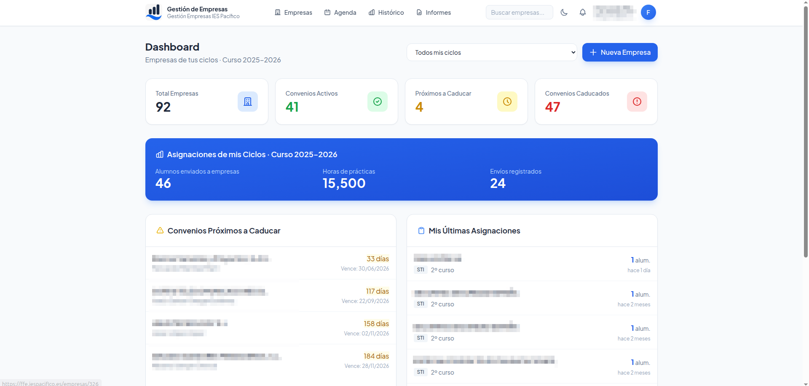
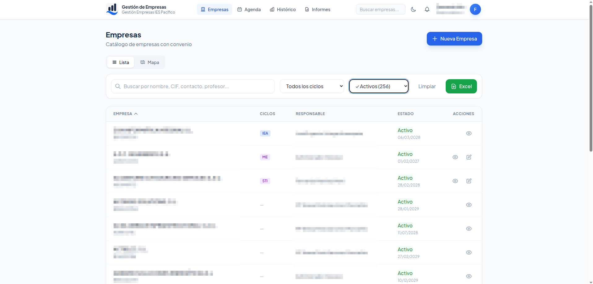
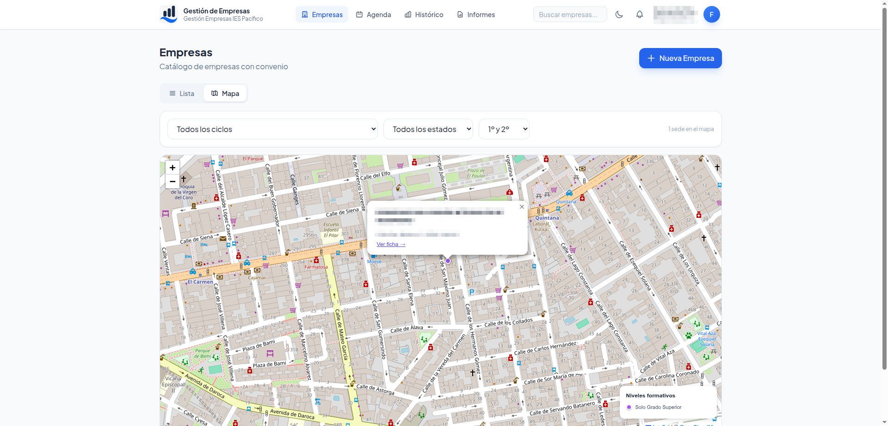
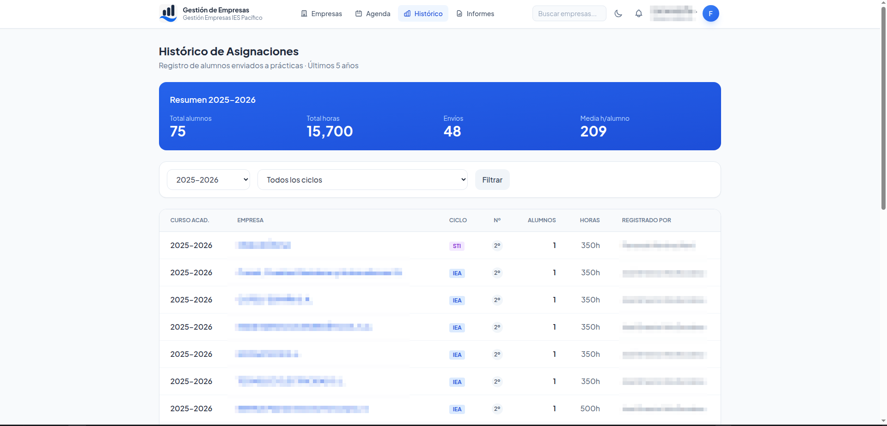
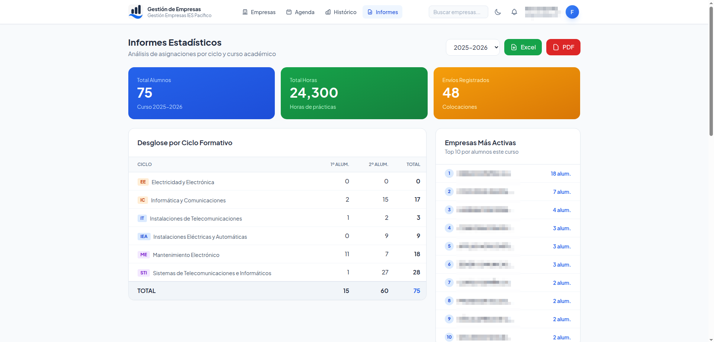
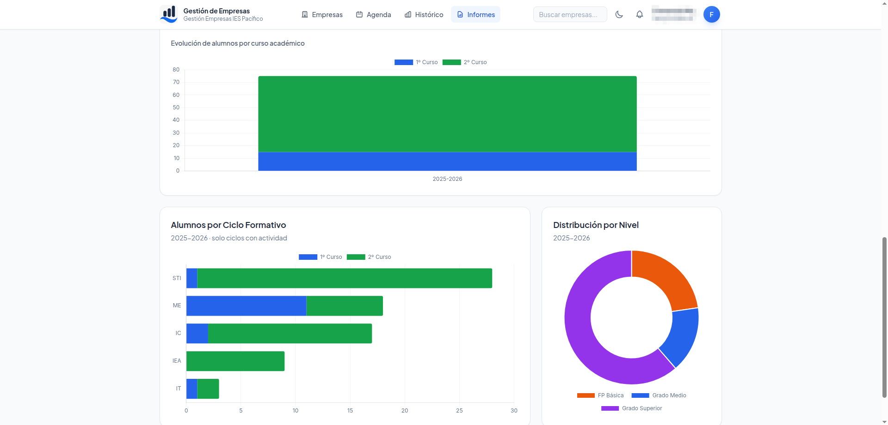

# Gestión de Empresas FFE

Plataforma web para gestión de empresas colaboradoras en la **Fase de Formación en Empresa (FFE)** de ciclos formativos. Desarrollada en el IES Pacífico (Madrid) y compartida con la comunidad educativa.

## Funcionalidades

- Alta, baja y modificación de empresas con convenio
- Registro de contactos (llamadas, emails, visitas, reuniones)
- Valoraciones de empresas por criterios cuantitativos
- Control de colocaciones y seguimiento laboral
- Generación de informes PDF y exportación a Excel
- Auditoría de cambios críticos
- Notificaciones automáticas (convenios por caducar, resúmenes mensuales)
- Autenticación LDAP

## Capturas de pantalla








## Stack técnico

- **Framework**: Laravel 11, PHP 8.2
- **Frontend**: Livewire 3, Blade, Tailwind CSS
- **Base de datos**: MySQL 8.0
- **Autenticación**: LDAP (compatible con [gestion-ldap](https://github.com/fmartinez-FP/gestion-ldap))
- **Reportes**: DomPDF, PHPOffice/PHPSpreadsheet

---

## Instalación con Docker (recomendado)

### Requisitos
- Docker 20+ y Docker Compose v2+

### 1. Clonar

```bash
git clone https://github.com/fmartinez-FP/gestion-empresas-ffe.git
cd gestion-empresas-ffe
```

### 2. Configurar entorno

```bash
cp .env.example .env
# Editar .env con los datos del centro
```

Variables clave a cambiar: `CENTRO_NOMBRE`, `DB_PASSWORD`, `DB_ROOT_PASSWORD`, `LDAP_*`, `MAIL_*`, `APP_URL`.

### 3. Levantar servicios

```bash
docker compose up -d
```

### 4. Inicializar

```bash
docker compose exec app php artisan key:generate
docker compose exec app php artisan migrate --seed
docker compose exec app php artisan config:cache
docker compose exec app php artisan route:cache
docker compose exec app php artisan view:cache
```

Accede en `http://localhost:8084` (puerto configurable con `APP_PORT` en `.env`).

---

## LDAP — autenticación

Esta aplicación requiere LDAP. Dos opciones:

**Opción A — gestion-ldap (recomendado para centros sin LDAP corporativo)**

Instala primero [gestion-ldap](https://github.com/fmartinez-FP/gestion-ldap), que incluye servidor OpenLDAP y panel web de gestión de usuarios. Configura en `.env`:

```env
LDAP_HOST=gestion-ldap-app
LDAP_BASE_DN=dc=tucentro,dc=local
LDAP_USERNAME=cn=admin,dc=tucentro,dc=local
LDAP_PASSWORD=tu_password_ldap
```

Para que ambas aplicaciones se vean entre sí, usa una red Docker externa en `docker-compose.yml`:

```yaml
networks:
  ffe-network:
    external: true
    name: gestion-ldap_default
```

**Opción B — LDAP corporativo existente**

Configura las variables `LDAP_*` en `.env` apuntando a tu servidor corporativo.

---

## Instalación sin Docker

```bash
git clone https://github.com/fmartinez-FP/gestion-empresas-ffe.git
cd gestion-empresas-ffe
composer install --optimize-autoloader --no-dev
cp .env.example .env
# Editar .env con DB_HOST=127.0.0.1 y resto de variables
php artisan key:generate
php artisan migrate --seed
chmod -R 775 storage bootstrap/cache
chown -R www-data:www-data storage bootstrap/cache
php artisan config:cache && php artisan route:cache && php artisan view:cache
```

Usa `docker/nginx/default.conf` como referencia para configurar tu virtualhost Nginx.

---

## Personalización

### Nombre del centro

```env
CENTRO_NOMBRE="IES Tu Centro"
CENTRO_NOMBRE_CORTO="IES Tu Centro"
APP_NAME="Gestión Empresas FFE"
```

### Logo

Coloca el logo en `public/images/logo.png` (recomendado: 200×60 px, fondo transparente).

### Ciclos formativos

Se gestionan desde el panel de administración, sin tocar código.

---

## Primer acceso

Accede con un usuario del grupo LDAP `ffe_users`. Para hacer administrador al primer usuario:

```sql
UPDATE users SET rol = 'admin' WHERE username = 'tu_usuario_ldap';
```

## Limpiar datos de ejemplo

```bash
docker compose exec app php artisan migrate:fresh
```

---

## Roles

| Rol | Descripción |
|-----|-------------|
| `admin` | Acceso total y configuración del sistema |
| `responsable_ffe` | Gestión completa de empresas y colocaciones |
| `responsable_ciclo` | Gestión de empresas de su ciclo formativo |
| `profesor` | Consulta y registro de contactos |

---

## Licencia

MIT — libre para uso, modificación y distribución en centros educativos.

Desarrollado en el **IES Pacífico** (Madrid). Si lo usas en tu centro, ¡nos encantaría saberlo!
